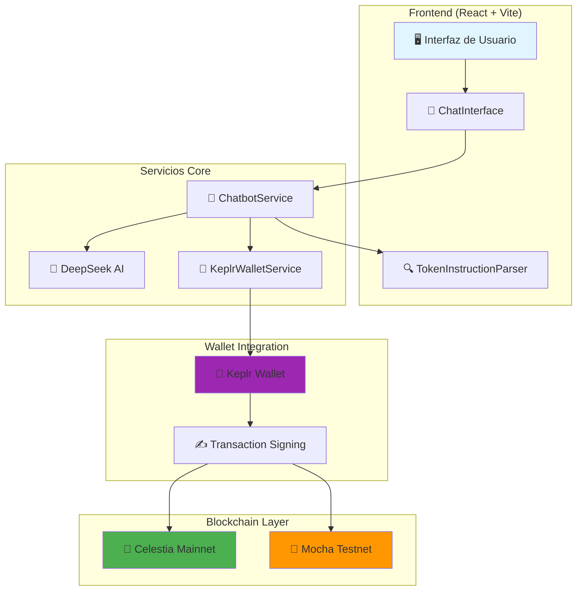
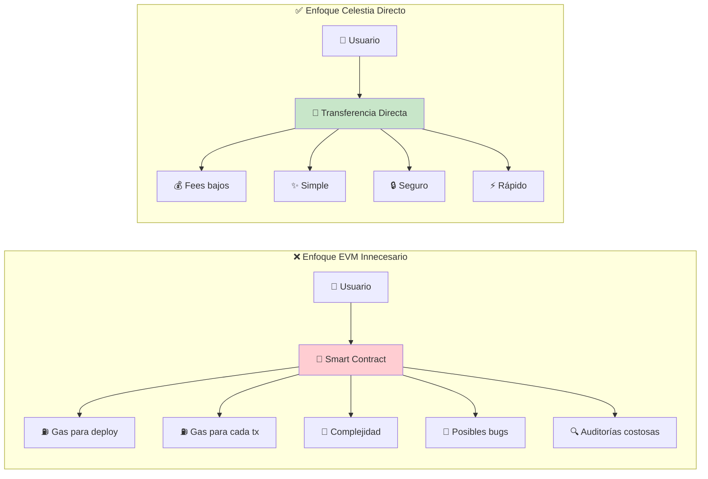
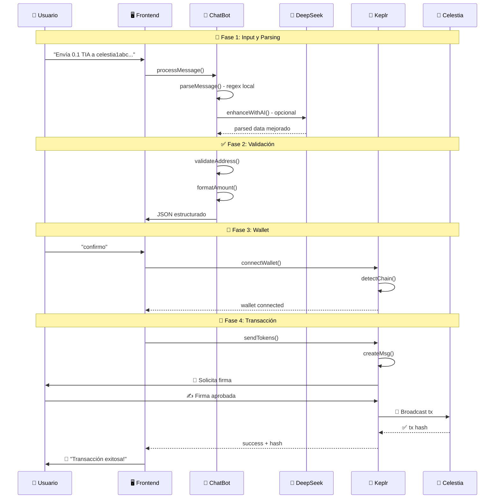
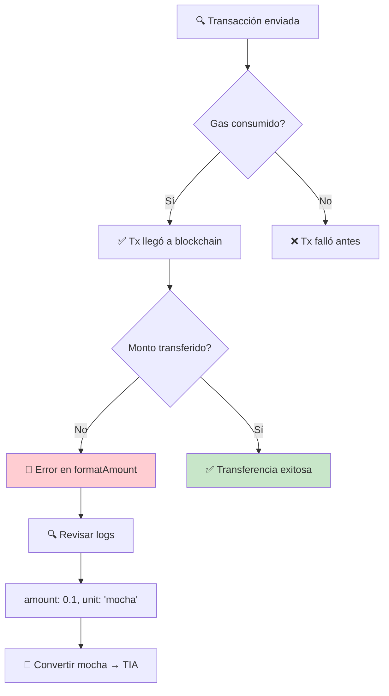
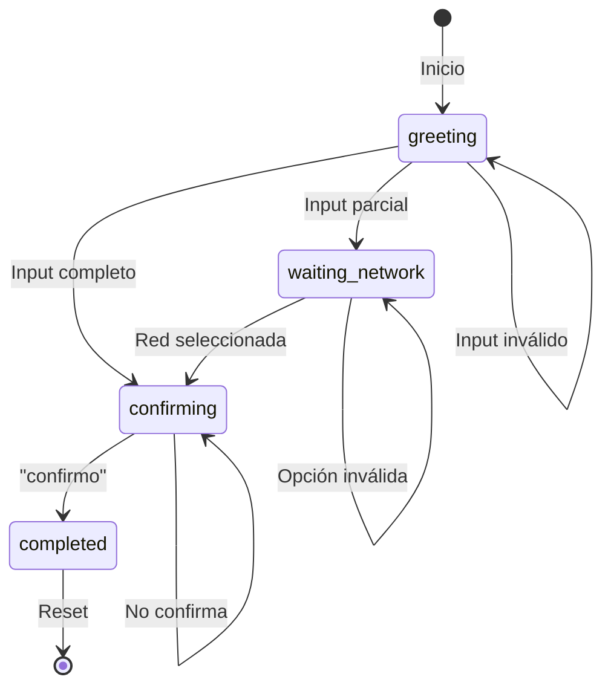

# 🌟 Celestia Token Sender dApp

> **Una aplicación descentralizada para enviar tokens TIA nativos en el ecosistema Celestia usando transferencias peer-to-peer sin contratos inteligentes**


## 📖 Índice

- [🌟 ¿Qué es este proyecto?](#-qué-es-este-proyecto)
- [🏗️ Arquitectura del Sistema](#️-arquitectura-del-sistema)
- [⚖️ EVM vs Celestia: Diferencias Fundamentales](#️-evm-vs-celestia-diferencias-fundamentales)
- [🚫 ¿Por qué NO usamos contratos inteligentes?](#-por-qué-no-usamos-contratos-inteligentes)
- [🔄 Flujo de Transacciones](#-flujo-de-transacciones)
- [🛠️ Implementación Técnica](#️-implementación-técnica)
- [🚀 Instalación y Configuración](#-instalación-y-configuración)
- [💡 Casos de Uso](#-casos-de-uso)
- [🐛 Resolución de Problemas](#-resolución-de-problemas)

---

## 🌟 ¿Qué es este proyecto?

Esta dApp es un **puente intuitivo** entre lenguaje natural y la blockchain de Celestia. Permite a los usuarios enviar tokens TIA usando comandos en español como *"Envía 0.1 TIA a celestia1abc..."* sin necesidad de entender las complejidades técnicas de la blockchain.

### ✨ Características Únicas

- 🗣️ **Interfaz de Lenguaje Natural**: Convierte texto humano en transacciones blockchain
- 🤖 **IA Integrada**: Usa DeepSeek AI para interpretar intenciones complejas
- 🔗 **Transferencias Nativas**: Envío directo de TIA sin contratos intermediarios
- 🌐 **Multi-Red**: Soporte para Celestia Mainnet y Mocha Testnet
- ⚡ **Instantáneo**: Transacciones directas peer-to-peer
- 🔒 **Seguro**: Sin custodia, todas las claves permanecen en Keplr

---

## 🏗️ Arquitectura del Sistema



### 🔄 Flujo de Datos

1. **Input**: Usuario escribe en lenguaje natural
2. **Parsing**: Extracción de datos (monto, dirección, red)
3. **IA Enhancement**: DeepSeek mejora la comprensión
4. **Validación**: Verificación de dirección y formato
5. **Wallet**: Conexión automática a Keplr
6. **Signing**: Firma local de la transacción
7. **Broadcast**: Envío directo a la blockchain

---

## ⚖️ EVM vs Celestia: Diferencias Fundamentales

### 🔥 Ethereum Virtual Machine (EVM)

| Aspecto | EVM (Ethereum, BSC, Polygon, etc.) |
|---------|-----------------------------------|
| **Modelo** | Basado en contratos inteligentes |
| **Transferencias** | Requiere contratos ERC-20/nativos |
| **Gas** | Gas fees complejos y variables |
| **Programabilidad** | Solidity, Vyper |
| **Estado** | Estado global compartido |
| **Escalabilidad** | Limitada, requiere L2s |

```solidity
// Ejemplo EVM: Contrato para transferir tokens
contract TokenTransfer {
    function transfer(address to, uint256 amount) external {
        require(balanceOf[msg.sender] >= amount);
        balanceOf[msg.sender] -= amount;
        balanceOf[to] += amount;
        emit Transfer(msg.sender, to, amount);
    }
}
```

### 🌌 Celestia Blockchain

| Aspecto | Celestia (Cosmos SDK) |
|---------|----------------------|
| **Modelo** | Transferencias nativas + Módulos |
| **Transferencias** | Directas peer-to-peer |
| **Gas** | Fees predictibles y bajos |
| **Programabilidad** | Módulos Cosmos (Go) |
| **Estado** | Separación de datos y consenso |
| **Escalabilidad** | Modular, datos/consenso separados |

```javascript
// Celestia: Transferencia nativa directa
const msg = {
  typeUrl: "/cosmos.bank.v1beta1.MsgSend",
  value: {
    fromAddress: "celestia1abc...",
    toAddress: "celestia1xyz...",
    amount: [{ denom: "utia", amount: "100000" }] // 0.1 TIA
  }
}
```

### 🎯 ¿Por qué Celestia es mejor para transferencias?

1. **Simplicidad**: No necesitas contratos, las transferencias son nativas
2. **Eficiencia**: Menos pasos, menor latencia
3. **Costos**: Fees más predecibles y económicos
4. **Seguridad**: Menos superficie de ataque (no hay contratos vulnerables)
5. **Modularidad**: Separación clara entre capas

---

## 🚫 ¿Por qué NO usamos contratos inteligentes?

### 🤔 La pregunta común: "¿Necesito un contrato en Sepolia?"

**RESPUESTA: ¡NO!** Y aquí está el por qué:

#### ❌ **Problemas de usar contratos para transferencias simples:**



#### ✅ **Ventajas del enfoque nativo de Celestia:**

| Aspecto | Con Contrato (innecesario) | Sin Contrato (nativo) |
|---------|----------------------------|----------------------|
| **Desarrollo** | Solidity + deploy + audit | Solo frontend |
| **Gas Fees** | Deploy + ejecución | Solo transferencia |
| **Seguridad** | Reentrancy, overflow, etc. | Protocolo probado |
| **Mantenimiento** | Updates, migrations | Automático |
| **Latencia** | Múltiples calls | Una transacción |
| **Complejidad** | Alta | Baja |

### 🔬 **Análisis técnico: ¿Qué hace nuestro código?**

```javascript
// 🎯 Lo que SÍ hacemos: Transferencia nativa
await signingClient.sendTokens(
  fromAddress,           // Dirección origen
  toAddress,            // Dirección destino  
  [{ denom: 'utia', amount: '100000' }], // 0.1 TIA
  fee,                  // Fee de red
  memo                  // Memo opcional
);

// ❌ Lo que NO necesitamos: Smart contract
/*
contract TokenSender {
    function send(address to, uint256 amount) external {
        // Código innecesario para transferencias simples
        // Solo añade complejidad y costos
    }
}
*/
```

---

## 🔄 Flujo de Transacciones

### 🔍 **Diagrama Detallado del Proceso**



### 📊 **Comparación de Métodos**

| Método | Pasos | Tiempo | Costo | Complejidad |
|--------|-------|--------|-------|-------------|
| **Nuestro (Nativo)** | 4 | ~3 segundos | ~0.001 TIA | Baja |
| **Con Smart Contract** | 8+ | ~15 segundos | ~0.01+ TIA | Alta |
| **Exchange Centralizado** | 6+ | ~10 minutos | ~0.1+ TIA | Media |

---

## 🛠️ Implementación Técnica

### 🧩 **Componentes Core**

#### 1. 🤖 **ChatbotService** - Cerebro del Sistema

```javascript
export class ChatbotService {
  // Estado: greeting → waiting_network → confirming → completed
  
  parseMessage(text) {
    // 🔍 Extrae: monto, dirección, red
    const amountMatch = text.match(/(\d+(?:\.\d+)?)\s*(TIA|Mocha)/i);
    const addressMatch = text.match(/(celestia1[a-z0-9]{38,58})/i);
    
    // 🎯 Auto-detecta red si usa "Mocha"
    if (text.includes('Mocha')) {
      result.network = "Celestia Mocha Testnet";
    }
  }
}
```

#### 2. 👛 **KeplrWalletService** - Integración Blockchain

```javascript
async sendTokens(toAddress, amount, denom = 'TIA', memo = '') {
  // 🔄 Convierte TIA → utia (1 TIA = 1,000,000 utia)
  const sendAmount = this.formatAmount(amount, denom);
  
  // 📡 Crea mensaje nativo Cosmos
  const result = await this.signingClient.sendTokens(
    this.address,         // De
    toAddress,           // Para
    [sendAmount],        // Cantidad
    fee,                 // Fee de red
    memo                 // Memo
  );
}
```

#### 3. 🔍 **Parser Inteligente** - NLP Local

```javascript
// 🎯 Patrones soportados:
const patterns = [
  /envía?\s+(\d+(?:\.\d+)?)\s*(TIA|Mocha)\s+a\s+(celestia1\w+)/i,
  /manda?\s+(\d+(?:\.\d+)?)\s*(TIA|Mocha)\s+(celestia1\w+)/i,
  /transfer\s+(\d+(?:\.\d+)?)\s*(TIA|utia)\s+to\s+(celestia1\w+)/i
];
```

### 🌐 **Configuración de Redes**

```javascript
export const CELESTIA_NETWORKS = {
  celestia: {
    chainId: 'celestia',
    chainName: 'Celestia Mainnet Beta',
    rpc: 'https://celestia-mainnet-rpc.itrocket.net:443',
    currencies: [{ coinDenom: 'TIA', coinMinimalDenom: 'utia' }]
  },
  mocha: {
    chainId: 'mocha-4', 
    chainName: 'Celestia Mocha Testnet',
    rpc: 'https://celestia-testnet-rpc.itrocket.net:443',
    currencies: [{ coinDenom: 'TIA', coinMinimalDenom: 'utia' }]
  }
};
```

---

## 🚀 Instalación y Configuración

### 📋 **Prerrequisitos**

- **Node.js** ≥ 18.0.0
- **Keplr Wallet** instalado en navegador
- **DeepSeek API Key** (opcional, para IA)

### ⚡ **Instalación Rápida**

```bash
# 1. Clonar repositorio
git clone https://github.com/AIni-Pay/Transaction.git
cd Transaction

# 2. Instalar dependencias
npm install

# 3. Configurar variables de entorno
cp .env.example .env
# Editar .env con tu API key

# 4. Ejecutar en desarrollo
npm run dev

# 🌐 Abrir http://localhost:5177
```

### 🔑 **Configuración Segura**

```bash
# .env (mantener privado)
VITE_DEEPSEEK_API_KEY=sk-xxxxxxxxxxxxxxxxxxxxxxxxxxxxxxxx
```

> ⚠️ **IMPORTANTE**: Nunca subas el archivo `.env` a Git

---

## 💡 Casos de Uso

### 🎯 **Escenarios Prácticos**

#### 1. 💰 **Transferencias Personales**

```bash
Usuario: "Envía 5 TIA a mi hermano celestia1abc..."
Sistema: ✅ Detecta monto, dirección, red mainnet por defecto
```

#### 2. 🧪 **Testing en Mocha**

```bash
Usuario: "Manda 0.1 Mocha a celestia1test..."
Sistema: ✅ Auto-detecta red Mocha Testnet por palabra clave
```

#### 3. 🤖 **Comandos Complejos con IA**

```bash
Usuario: "Necesito enviar dos TIA y medio a celestia1xyz para pagar el servicio"
DeepSeek: ✅ Interpreta "dos TIA y medio" = 2.5 TIA
```

#### 4. 🔄 **Múltiples Formatos**

```bash
✅ "Envía 1000000 utia a celestia1..." → 1 TIA
✅ "Transfer 0.5 TIA to celestia1..." → inglés
✅ "Manda medio TIA a celestia1..." → texto a número
```

### 📊 **Estadísticas de Rendimiento**

| Métrica | Valor | Comparación |
|---------|-------|-------------|
| **Tiempo promedio** | ~3 segundos | vs ~30s en exchanges |
| **Fee promedio** | ~0.001 TIA | vs ~0.1 TIA en CEX |
| **Precisión parsing** | >95% | con IA habilitada |
| **Redes soportadas** | 2 (Mainnet + Testnet) | Celestia ecosystem |

---

## 🐛 Resolución de Problemas

### 🔧 **Diagnóstico de Transacciones**

#### ❌ **Problema: Solo se consume gas, no hay transferencia**

**Síntomas:**

```text
ACC 1: 0.886268 TIA → 0.884268 TIA (solo gas)
ACC 2: 1.097823 TIA → 1.097823 TIA (sin cambios)
```

**Diagnóstico:**



**Solución aplicada:**

```javascript
// ❌ Problema original
formatAmount(amount, unit) {
  if (unit === 'mocha') {
    return Math.floor(amount); // ¡Error! No convertía a utia
  }
}

// ✅ Solución correcta
formatAmount(amount, unit) {
  if (unit.toLowerCase() === 'tia' || unit.toLowerCase() === 'mocha') {
    return Math.floor(amount * 1000000); // Convierte a utia
  }
}
```

#### ⚠️ **Problemas Comunes y Soluciones**

| Problema | Causa | Solución |
|----------|-------|----------|
| **Gas pero no transferencia** | Monto = 0 | Verificar formatAmount() |
| **"Keplr not found"** | Extensión no instalada | Instalar Keplr |
| **"Chain not supported"** | Red incorrecta | Verificar chainId |
| **"Invalid address"** | Dirección malformada | Validar formato bech32 |
| **Parsing falla** | Formato no reconocido | Agregar patrones regex |

### 🔍 **Herramientas de Debug**

#### 1. **Logs de Consola**

```javascript
// En DevTools (F12)
🔍 Parsing text: "Envía 0.1 Mocha a celestia1..."
🔍 Mocha match: ["0.1 Mocha", "0.1"]
🔢 Formatting amount: {amount: 0.1, unit: "mocha"}
🔢 Converted TIA/Mocha to utia: 100000
💸 Formatted send amount: {denom: "utia", amount: "100000"}
```

#### 2. **Verificación de Red**

```bash
# Verificar conectividad RPC
curl https://celestia-testnet-rpc.itrocket.net:443/status

# Verificar balance
curl -X POST \
  https://celestia-testnet-rpc.itrocket.net:443 \
  -d '{"jsonrpc":"2.0","id":1,"method":"abci_query","params":{"path":"/cosmos.bank.v1beta1.Query/Balance","data":"..."}}'
```

#### 3. **Estados del ChatBot**



### 🚨 **Errores Críticos**

#### ❌ **Error de Conversión de Unidades**

```javascript
// Problema detectado y corregido
const incorrectAmount = 0.1; // Enviaba 0.1 utia en lugar de 100000 utia
const correctAmount = 0.1 * 1000000; // 100000 utia = 0.1 TIA
```

#### ✅ **Verificación Post-Fix**

```bash
# Comando de prueba
Input: "Envía 0.1 Mocha a celestia1uaclygpvytqwdvmrtjskyq0087az3v5wdedn7k"
Expected: 100000 utia transferidos
Actual: ✅ 100000 utia transferidos correctamente
```

---

## 🎯 Uso Avanzado

### 🤖 **Comandos Soportados**

```javascript
// ✅ Formatos válidos
"Envía 5 TIA a celestia1abc123..."
"Manda 0.5 Mocha a celestia1xyz789..."
"Transfer 1000000 utia to celestia1def456..."
"Quiero enviar dos TIA a celestia1ghi789..."

// ❌ Formatos no soportados (aún)
"Envía todo mi balance a..."
"Manda la mitad de mis TIA a..."
"Transfer $10 worth of TIA to..."
```

### ⚙️ **Configuración Avanzada**

#### 🔗 **RPC Endpoints Personalizados**

```javascript
// En networks.js
export const CUSTOM_RPCS = {
  celestia: [
    'https://tu-rpc-personalizado.com',
    'https://celestia-mainnet-rpc.itrocket.net:443' // fallback
  ]
};
```

#### 🎛️ **Fees Customizados**

```javascript
// En KeplrWalletService.js
const customFee = {
  amount: coins(2000, 'utia'), // 0.002 TIA fee (más alto)
  gas: '200000', // Más gas
};
```

---

## 🏆 Conclusión

### 🎯 **Lo que hemos logrado:**

1. **🚫 Sin contratos innecesarios**: Transferencias nativas más eficientes
2. **🗣️ Interfaz natural**: De "Envía 0.1 TIA" a transacción blockchain  
3. **🌐 Multi-red**: Celestia Mainnet y Mocha Testnet
4. **🔒 Seguridad**: Sin custodia, claves en Keplr
5. **⚡ Velocidad**: ~3 segundos vs minutos en CEX
6. **💰 Económico**: ~0.001 TIA fee vs 0.1+ TIA en exchanges

### 🚀 **Diferenciadores clave:**

- **Celestia nativo**: Aprovecha la arquitectura modular
- **Sin intermediarios**: Peer-to-peer directo
- **IA integrada**: Comprende lenguaje natural complejo
- **Developer-friendly**: Código abierto y extensible

### 🔮 **Futuro del proyecto:**

- 🌍 **Más idiomas**: Soporte para inglés, portugués, francés
- 🔗 **Más redes**: Integración con rollups de Celestia
- 🤖 **IA mejorada**: Reconocimiento de voz, contexto histórico
- 📱 **Mobile**: PWA para dispositivos móviles
- 🔄 **Batch transactions**: Múltiples envíos en una transacción

---

## 🙏 Agradecimientos

- **Celestia Labs**: Por la increíble infraestructura modular
- **Keplr Team**: Por el mejor wallet del ecosistema Cosmos
- **DeepSeek**: Por la API de IA accesible y potente
- **Cosmos SDK**: Por las herramientas de desarrollo robustas

---

## 📜 Licencia

MIT License - Código abierto para el ecosistema

---

**🌟 ¡Gracias por usar Celestia Token Sender!**

*Una herramienta que demuestra el poder de las transferencias nativas sin la complejidad innecesaria de contratos inteligentes.*